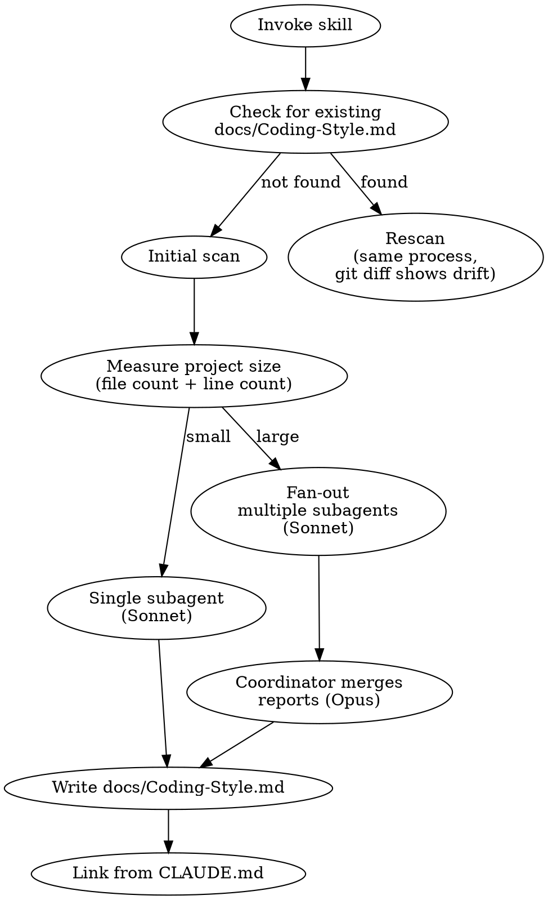

# Analyzing Coding Style

## Overview

Analyze a project's codebase to extract non-obvious coding conventions and produce a
`docs/Coding-Style.md` linked from the project's CLAUDE.md. Focuses exclusively on
patterns that linters and formatters cannot enforce.

## When to Use

- Onboarding to a new codebase — catalog conventions before contributing
- Setting up a project for AI agent collaboration — give agents immediate style context
- Periodic rescan — regenerate after significant codebase evolution (git diff shows drift)

**When NOT to use:**
- Setting up linters or formatters (that's tooling, not documentation)
- Code review (use a review skill)
- Enforcing style (this skill describes, never prescribes)

## Core Principles

1. **Descriptive, never prescriptive.** Document what the project DOES, not what it SHOULD do. No "Never do X" or "Always prefer Y" — only "This project does X in N/M files."
2. **Only what linters can't catch.** Formatting, brace style, indentation, semicolons, camelCase vs snake_case for a language where one is standard — these belong in linter configs. If `eslint`, `rustfmt`, `black`, or `clang-format` can enforce it, skip it.
3. **Quantitative confidence.** Every pattern gets a count: "23/25 files" or "all 12 error handlers." Qualitative labels like "High" or "Medium" are forbidden — they're vague and non-actionable.
4. **Concise output.** The style guide should be significantly shorter than the codebase. One paragraph per pattern with a representative example. No exhaustive listings.

## Process



### Step 1: Check project state

```bash
# Does the style guide already exist?
ls docs/Coding-Style.md 2>/dev/null

# Measure project size (exclude vendored/generated code)
find . -type f \( -name '*.py' -o -name '*.rs' -o -name '*.ts' -o -name '*.js' \
  -o -name '*.go' -o -name '*.c' -o -name '*.h' -o -name '*.sh' -o -name '*.rb' \
  -o -name '*.java' -o -name '*.kt' \) \
  -not -path '*/node_modules/*' -not -path '*/.git/*' \
  -not -path '*/target/*' -not -path '*/vendor/*' -not -path '*/dist/*' \
  -not -path '*/__pycache__/*' | wc -l

# Identify languages present
find . -type f -not -path '*/node_modules/*' -not -path '*/.git/*' \
  -not -path '*/target/*' -not -path '*/vendor/*' | \
  sed 's/.*\.//' | sort | uniq -c | sort -rn | head -20
```

### Step 2: Dispatch analysis

**Always dispatch at least one subagent** — never analyze in the main conversation context.

**Small project (under ~500 files / ~50k lines):** Dispatch a single Sonnet subagent with the analysis prompt below.

**Large project:** Fan out with depth-adaptive partitioning:
1. List top-level directories with file counts
2. If any directory holds >60% of files, recurse one level and split its children
3. Cap at 4-6 Sonnet subagents — merge small partitions together
4. Each subagent analyzes its partition
5. Opus coordinator merges reports into unified style guide

### Step 3: Subagent analysis prompt

Give each subagent this task (adjust paths for partition scope):

```
Analyze the coding style conventions in [path]. For EACH pattern you find:

1. State the pattern in one sentence
2. Show ONE representative code example (shortest clear example)
3. Count how consistently it appears: "N/M files" or "N/M functions"
4. Note the directory scope if it's localized to a subtree

RULES:
- ONLY patterns that linters/formatters CANNOT enforce. Skip: indentation,
  brace placement, semicolons, naming case conventions that are language
  defaults (camelCase in JS/TS, snake_case in Python/Rust).
- Skip patterns that are just "uses the framework/library as documented."
  "Uses Vitest describe/it blocks" or "uses Express middleware" are not
  conventions — they're baseline usage. Only document WHERE the project
  departs from or extends the default framework patterns.
- Be DESCRIPTIVE not prescriptive. Say "this project does X in N/M files."
  Never say "always do X" or "never do Y."
- Keep each pattern to one paragraph + one SHORT code block (under 8 lines).
  Show the minimum needed to recognize the pattern. No exhaustive listings.

SEED CATEGORIES (investigate these, but also report novel patterns):
- Naming philosophy (beyond language defaults)
- Error handling idioms
- Module/file organization patterns
- Test structure and conventions
- Documentation conventions (file headers, comment style)
- Import/dependency patterns
- Language-specific idioms
- Architectural patterns (DI, factories, singletons, etc.)

For each pattern, note whether it appears project-wide or only in specific
directories.

Return your findings as a markdown document organized by category.
If multiple languages are present, organize as top-level language sections
with categories nested under each language.
```

### Step 4: Write output

Create `docs/Coding-Style.md` with this structure:

```markdown
# Coding Style — [Project Name]

[1-2 sentence summary of the project and its primary language(s)]

## Project-Wide Conventions

[Patterns that appear consistently across the entire codebase]

## [Language] Conventions

[If polyglot: one section per language, categories nested under each]

### [Category]

**[Pattern name]** (N/M files)

[One sentence description]

```[lang]
[shortest representative example]
`` `

## Subsystem Conventions

### [directory/path]

[ONLY patterns unique to this subtree — do NOT repeat project-wide patterns here.
If a subsystem follows the same conventions as the rest of the project, omit it.]
```

### Step 5: Link from CLAUDE.md

Check if CLAUDE.md has a "Conventions" section (or similar: "Conventions & Patterns",
"Style", "Coding Standards"). If found, add the link there. If not, append a new section.

**Idempotent:** Check if the link already exists before adding.

```markdown
See [Coding Style](docs/Coding-Style.md) for project coding conventions.
```

## Common Mistakes

| Mistake | Fix |
|---------|-----|
| Documenting language defaults (camelCase in TS) | Ask: "Would a linter catch this?" If yes, skip it |
| Documenting baseline framework usage ("uses Vitest describe/it") | Only document where the project departs from or extends defaults |
| Qualitative confidence ("High", "Medium") | Count: "23/25 files", "all 12 handlers" |
| Prescriptive language ("Always use X") | Descriptive: "This project uses X in N/M cases" |
| Exhaustive code listings | One short example per pattern (under 8 lines) |
| Including version/date metadata | Git tracks this — skip it |
| Analyzing in main conversation context | Always dispatch subagent(s) to preserve context |
| Treating all patterns as project-wide | Check directory scope — some are subsystem-local |
| Repeating project-wide patterns in subsystem sections | Subsystem sections: only patterns unique to that subtree |

## Fan-Out Partitioning Details

When the project exceeds the size threshold:

1. **List candidates:** `find . -mindepth 1 -maxdepth 1 -type d` with file counts per directory
2. **Depth-adapt:** If any top-level dir has >60% of files, recurse one level: split its children into separate partitions
3. **Bin small partitions:** Sort by size descending. Assign largest partitions their own agent. Merge remaining small ones until you hit the 4-6 agent cap.
4. **Coordinator prompt:** "Merge these N reports into a single Coding-Style.md. Patterns reported by multiple partitions are project-wide (note combined count). Patterns from only one partition are subsystem-local (note directory scope). Resolve conflicts by higher count. Remove duplicates. Maintain quantitative confidence ratings throughout."
