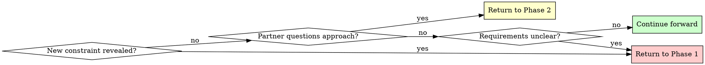

# Brainstorming Ideas Into Designs

## Overview

Transform rough ideas into fully-formed designs through structured questioning and alternative exploration.

**Core principle:** Ask questions to understand, explore alternatives, present design incrementally for validation.

**Consult smart:** When a perspective gap appears, compose a Role block (see consulting-agents) and task the general-purpose agent for targeted techniques, architecture patterns, or stack recommendations.

**Announce at start:** "I'm using the brainstorming skill to refine your idea into a design."

## Quick Reference

| Phase | Key Activities | Tool Usage | Output |
|-------|---------------|------------|--------|
| **1. Understanding** | Ask questions (one at a time) | AskUserQuestion for choices | Purpose, constraints, criteria |
| **1.5. Consultation & Premise Validation** | Validate premise, gather architecture/tech stack insights | Task tool (general-purpose + optional Role block) | Validated premise, option bank, risk notes |
| **2. Exploration** | Propose 2-3 approaches | AskUserQuestion for approach selection | Architecture options with trade-offs |
| **3. Design Presentation** | Present in 200-300 word sections | Open-ended questions | Complete design with validation |
| **4. Design Documentation** | Write design document | writing-clearly-and-concisely skill | Design doc in docs/plans/ |
| **5. Worktree Setup** | Set up isolated workspace | using-git-worktrees skill | Ready development environment |
| **6. Planning Handoff** | Create implementation plan | writing-plans skill | Plan + queued task briefs |

## The Process

Copy this checklist to track progress:

```
Brainstorming Progress:
- [ ] Phase 1: Understanding (purpose, constraints, criteria gathered)
- [ ] Phase 1.5: Consultation & Premise Validation (role-tuned agent inputs captured, premise validated OR alternatives documented)
- [ ] Phase 2: Exploration (2-3 approaches proposed and evaluated)
- [ ] Phase 3: Design Presentation (design validated in sections)
- [ ] Phase 4: Design Documentation (design written to docs/plans/)
- [ ] Phase 5: Worktree Setup (if implementing)
- [ ] Phase 6: Planning Handoff (if implementing)
```

### Phase 1: Understanding
- Check current project state in working directory
  - **Optional:** Consult discovery agents (see `consultants:consulting-agents`) to find relevant existing code, patterns, or components
  - Helpful when idea builds on or interacts with existing functionality
- Ask ONE question at a time to refine the idea
- **Use AskUserQuestion tool** when you have multiple choice options
- Gather: Purpose, constraints, success criteria

**Example using AskUserQuestion:**
```
Question: "Where should the authentication data be stored?"
Options:
  - "Session storage" (clears on tab close, more secure)
  - "Local storage" (persists across sessions, more convenient)
  - "Cookies" (works with SSR, compatible with older approach)
```

### Phase 1.5: Consultation & Premise Validation

**When Phase 1.5 is REQUIRED:**

Use Phase 1.5 for **significant features** - skip only for trivial changes.

**Significant features include:**
- New services, databases, or external integrations
- Architecture changes (new patterns, storage layers, async processing)
- Security-sensitive functionality (auth, payments, PII handling)
- Performance-critical paths (high-traffic APIs, real-time processing)
- Multi-domain complexity (touches 3+ technical domains)

**Red flags that trigger Phase 1.5:**
- "We should add..." without evidence of need
- "Users might want..." without metrics or user research
- Solutions looking for problems
- Complexity increases without validated benefit

#### Consultation Workflow (REQUIRED)

**1. Map the perspectives needed:**
- Premise pressure test (evidence, alternatives, hidden constraints)
- Architecture/tech stack recommendations (patterns, algorithms, data stores)
- Execution risks (observability, operations, rollout)

**2. Compose Role blocks when the conversation needs a specific lens.**
Use the Dynamic Role Prompt Composer in `consulting-agents`:
- Seniority + domain focus + mandate sentence
- Example: `Role: Principal Data Platform Architect prioritizing operational simplicity and SLA guardrails.`

**3. Draft the task prompt below the Role block.** Include:
- What to evaluate or design
- Current context (Stage, user goals, constraints gathered in Phase 1)
- Specific questions to answer (see lists below)

**4. Run the Task Prompt Iteration Protocol** (max 3 passes) with the chosen agent. Let the agent confirm the prompt has enough detail before dispatching fresh context.

**Premise validation questions that MUST be addressed:**
1. **Evidence of need:** What metrics/data show this problem exists?
2. **Current state:** What's actually failing with current approach?
3. **Simpler alternatives:** Can we solve this without the proposed complexity?
4. **Complexity costs:** What's the operational/maintenance burden?
5. **Success criteria:** How will we know this actually helped?

**Technique & architecture exploration prompts:**
```
Role: Principal Frontend Platform Engineer focused on performance + accessibility parity.
Task: Recommend 2-3 implementation strategies for [feature]. For each, outline:
- Framework/library choices (and why)
- Critical components or layers to add
- Testing + observability hooks needed
- Risks that need mitigation
```

**Parallelize with intent when multiple lenses matter:**
```
- Agent #1 (Role: Staff Database Reliability Engineer): "Challenge the premise + data design."
- Agent #2 (Role: Senior Application Security Reviewer): "Enumerate auth/PII threats."
- Agent #3 (no role): "Propose simpler alternatives that meet the stated success criteria."
```

**Incorporate feedback:**
- If consultations surface fatal flaws → Return to Phase 1 or abandon idea
- If they suggest simpler alternatives → Explore and compare them in Phase 2
- If premise validated → Capture the evidence, selected patterns, and risks in your notes before moving on

**TodoWrite enforcement:**

Add these todos when entering Phase 1.5:
1. "Consult agents (with Role blocks where helpful) for premise + architecture validation on [domains]"
2. "Synthesize consultation findings into design notes (evidence, options, risks)"

**Output:** Validated premise with recorded evidence, plus a bank of viable approaches and risks to carry into Phase 2.

### Phase 2: Exploration

**Step 1: Draft approaches**
- Propose 2-3 different approaches
- For each: Core architecture, trade-offs, complexity assessment

**Step 2: Domain evaluation (if needed)**

**When domain evaluation is needed:**
- Approaches have significant architectural trade-offs (event-driven vs synchronous, storage patterns, concurrency models)
- Performance, security, or scalability implications differ between options
- Multiple valid technical solutions with different complexity/benefit profiles

**When you can skip domain evaluation:**
- Approach is straightforward with no architectural decisions
- Phase 1.5 consultation already addressed approach evaluation
- Work is cleanup, deletion, or obvious implementation

**If skipping:** Briefly explain why (e.g., "Already validated in Phase 1.5" or "No architectural trade-offs to evaluate").

**If needed:**
- **Use Task tool** with general-purpose agents and domain-focused wording
- Ask agents to evaluate technical soundness of each approach from domain perspective
- Questions: Performance characteristics, scalability, failure modes, operational complexity

**Example consultation (domain-focused task wording):**
```
Task: general-purpose

"Evaluate these 3 database approaches for [feature] from a database performance and scalability perspective:

Approach A: [description]
Approach B: [description]
Approach C: [description]

For each, assess with database expertise:
- Query performance: N+1 queries? Index usage? Join complexity?
- Schema migration: Breaking changes? Data migration cost?
- Scalability: How does it perform at 10x, 100x, 1000x data volume?
- Data consistency trade-offs"
```

**Step 3: Present evaluated approaches to Jerry**
- Incorporate domain evaluation feedback into trade-off descriptions
- **Use AskUserQuestion tool** to present approaches as structured choices
- Ask which approach resonates

**Example using AskUserQuestion:**
```
Question: "Which architectural approach should we use?"
Options:
  - "Event-driven with message queue" (scalable, complex setup, eventual consistency - architect notes: introduces retry complexity)
  - "Direct API calls with retry logic" (simple, synchronous, easier to debug - architect notes: may hit rate limits)
  - "Hybrid with background jobs" (balanced, moderate complexity - architect notes: best fault isolation)
```

### Phase 3: Design Presentation
- Present in 200-300 word sections
- Cover: Architecture, components, data flow, error handling, testing
- Ask after each section: "Does this look right so far?" (open-ended)
- Use open-ended questions here to allow freeform feedback

### Phase 4: Design Documentation
After design is validated, write it to a permanent document:
- **File location:** `docs/plans/YYYY-MM-DD-<topic>-design.md` (use actual date and descriptive topic)
- **RECOMMENDED SUB-SKILL:** Use elements-of-style:writing-clearly-and-concisely (if available) for documentation quality
- **Content:** Capture the design as discussed and validated in Phase 3, organized into the sections that emerged from the conversation
- Commit the design document to git before proceeding

### Phase 5: Worktree Setup (for implementation)
When design is approved and implementation will follow:
- Announce: "I'm using the using-git-worktrees skill to set up an isolated workspace."
- **REQUIRED SUB-SKILL:** Use superpowers:using-git-worktrees
- Follow that skill's process for directory selection, safety verification, and setup
- Return here when worktree ready

### Phase 6: Planning Handoff
Ask: "Ready to create the implementation plan?"

When your human partner confirms (any affirmative response):
- Announce: "I'm using the writing-plans skill to create the implementation plan."
- **REQUIRED SUB-SKILL:** Use writing-plans
- Create detailed plan in the worktree
- Queue follow-up: "I'm using the writing-tasks skill to draft the task briefs." Run that skill for each task that needs a brief before execution begins.

## Question Patterns

### When to Use AskUserQuestion Tool

**Use AskUserQuestion for:**
- Phase 1: Clarifying questions with 2-4 clear options
- Phase 2: Architectural approach selection (2-3 alternatives)
- Any decision with distinct, mutually exclusive choices
- When options have clear trade-offs to explain

**Benefits:**
- Structured presentation of options with descriptions
- Clear trade-off visibility for partner
- Forces explicit choice (prevents vague "maybe both" responses)

### When to Use Open-Ended Questions

**Use open-ended questions for:**
- Phase 3: Design validation ("Does this look right so far?")
- When you need detailed feedback or explanation
- When partner should describe their own requirements
- When structured options would limit creative input

**Example decision flow:**
- "What authentication method?" → Use AskUserQuestion (2-4 options)
- "Does this design handle your use case?" → Open-ended (validation)

## When to Revisit Earlier Phases



**You can and should go backward when:**
- Partner reveals new constraint during Phase 2 or 3 → Return to Phase 1
- Validation shows fundamental gap in requirements → Return to Phase 1
- Partner questions approach during Phase 3 → Return to Phase 2
- Something doesn't make sense → Go back and clarify

**Don't force forward linearly** when going backward would give better results.

## Key Principles

| Principle | Application |
|-----------|-------------|
| **One question at a time** | Phase 1: Single question per message, use AskUserQuestion for choices |
| **Structured choices** | Use AskUserQuestion tool for 2-4 options with trade-offs |
| **YAGNI ruthlessly** | Remove unnecessary features from all designs |
| **Explore alternatives** | Always propose 2-3 approaches before settling |
| **Incremental validation** | Present design in sections, validate each |
| **Flexible progression** | Go backward when needed - flexibility > rigidity |
| **Announce usage** | State skill usage at start of session |
