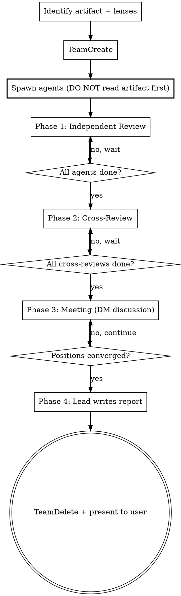

# Design Meeting

Spin up a team of domain-focused agents to review an artifact from multiple angles. Agents review independently, cross-examine each other's work, then meet to debate and converge. The lead facilitates and writes the final report.

**NOT for:** Simple lookups (consulting-agents), single-perspective reviews (consulting-agents), implementation (subagent-driven-development), or generating designs from scratch (brainstorming).

## When to Use

- A spec, design, or architecture document needs validation before implementation
- A complex bug needs multiple domain angles (root cause, blast radius, related patterns)
- An architecture decision needs perspectives on trade-offs
- Any artifact where a single reviewer would miss things
- Jerry asks for "design review," "design meeting," "get fresh eyes on this," or "war room"

## Process Flow



## Phase 0: Setup

1. **Identify the artifact** — file path(s) to the spec, design, code, or bug report
2. **Gather product context** — who is the target user? What is the artifact for? What level of sophistication is needed? This context MUST go in every agent's initial prompt. Discovering product context mid-meeting wastes an entire review cycle.
3. **Pick 2-4 domain lenses** based on what's being reviewed:

| Reviewing | Possible lenses |
|-----------|----------------|
| Binary format spec | Systems/perf, data modeling, consumer/viewer, compatibility |
| API design | Security, ergonomics, backwards compat, error handling |
| Generation algorithm | Domain accuracy, performance, testability |
| Bug investigation | Root cause analysis, reproduction strategy, blast radius, related code patterns |
| Architecture decision | Scalability, maintainability, operational complexity, migration risk |

These are examples — pick lenses that match the artifact.

4. **TeamCreate** with a descriptive name (e.g., `ohex-spec-review`)
5. **Spawn all agents in parallel** — see Agent Prompt Template below

### Critical Sequence Rule

**Spawn agents BEFORE you deeply analyze the artifact.** If you read and analyze first, you WILL rationalize doing everything solo. The sequence is:

```
Identify lenses → TeamCreate → Spawn agents → They read independently
```

Not:

```
Read artifact → "I already see the issues" → Skip team → Solo review
```

## Phase 1: Independent Review

Each agent reads the artifact through their assigned lens and writes findings to:
```
${PROJECT_ROOT}/.claude/scratchpad/meetings/{team-name}/{agent-name}-review.md
```

Report structure:
```markdown
# {Domain Lens} Review: {Artifact Name}

## Summary
2-3 sentence overview of findings from this lens.

## Findings
- **[severity: high/medium/low]** Finding description with evidence

## Questions
Items that need clarification or discussion.

## Recommendations
Specific actionable suggestions.
```

Agents notify lead when done. Wait for all agents before proceeding.

## Phase 2: Cross-Review

Send each agent a message telling them to read the other agents' Phase 1 reports. Provide the file paths explicitly.

Each agent writes cross-review notes to:
```
${PROJECT_ROOT}/.claude/scratchpad/meetings/{team-name}/{agent-name}-cross-review.md
```

Cross-review structure:
```markdown
# Cross-Review: {Agent Name}

## Agreements
Findings from other reviewers I concur with and why.

## Challenges
Findings I disagree with, with my reasoning.

## Gaps
Issues the other reviewers missed that my lens catches.
```

Wait for all agents before proceeding.

## Phase 3: Meeting

1. **Lead poses framing** — 1-2 questions based on themes from Phases 1-2 (e.g., "The main tension is X vs Y — discuss")
2. **Agents respond and discuss** — they DM each other directly to debate, challenge, and refine
3. **Lead monitors** — ask follow-ups if discussion stalls or misses something, but let agents drive
4. **Continue until** positions converge or remaining disagreements are clearly articulated

If agents are only reporting to the lead and not engaging each other, explicitly prompt: "Have you discussed this directly with {agent-name}? Send them a message."

## Phase 4: Report

Lead writes the final report to:
```
${PROJECT_ROOT}/.claude/scratchpad/meetings/{team-name}/report.md
```

Report structure:
```markdown
# Design Meeting Report: {Artifact Name}
Date: {date}
Participants: {agent names and lenses}

## Executive Summary
Key findings and overall assessment.

## Consensus Items
Issues all reviewers agree on.

## Resolved Disagreements
Issues where discussion led to convergence, with reasoning.

## Open Questions
Unresolved items that need human decision.

## Recommendations
Specific changes or actions, with severity. Flag issues — do not modify the artifact.
```

After writing: `TeamDelete` to clean up, then present summary to user with link to full report.

## Agent Prompt Template

```
**Role:** {Domain lens} reviewer for a design meeting.

**Task:** Review the following artifact through your domain lens and write
your findings.

**Product context:** {Who is the target user? What is this for? What
existing systems are NOT the target consumer? This prevents agents from
anchoring on the wrong reference point.}

**Target:** {Brief description of what we're building and at what level
of sophistication.}

**Audience:** {Who needs to understand the output and at what level.}

**Artifact:** Read the file at {path}. Form your own analysis — do not
ask the lead for a summary.

**Your domain lens:** {Specific focus areas for this lens.}

**Your teammates:**
- {name-1} — {their lens}
- {name-2} — {their lens}
(etc.)

You can message teammates directly via SendMessage(to: "{name}").
To broadcast to all teammates, message each one individually.
There is no group channel. During the meeting phase, you MUST engage
with teammates directly — send them messages to challenge findings,
ask questions, and debate positions. Do not just report to the lead.

**Phase 1 instructions:** Read the artifact, write your review to:
{scratchpad path}/{your-name}-review.md
Notify the lead when done.
```

## Disciplines

**Spawn before analyzing.** The single most important rule. If the lead reads the artifact first, the team never gets spawned.

**Short, focused messages.** One topic per message to agents. Long multi-topic messages get partially processed.

**Don't skip cross-review.** It's tempting to jump from independent review to meeting. Cross-review is where agents discover they disagree — without it, the meeting produces an echo chamber.

**Let agents drive the meeting.** After framing, resist steering. The value is in agents challenging each other. Intervene only when stuck or off-topic.

## Failure Modes

| Symptom | Cause | Fix |
|---------|-------|-----|
| Lead does solo review | Read artifact before spawning | Follow spawn-before-analyzing rule |
| Superficial cross-reviews | Agents agreeing to be agreeable | Prompt: "What specifically do you disagree with?" |
| Hub-spoke meeting | Agents report to lead, not each other | Prompt: "Discuss this with {name} directly" — send individual messages, not broadcast |
| Meeting goes in circles | No clear framing | Lead poses sharper question, summarizes positions so far |
| Agents miss key issues | Wrong lenses chosen | Add an agent mid-meeting if needed |
| Agents anchor on wrong reference | Missing product context in prompt | Product context MUST be in Phase 0 agent prompts, not discovered mid-meeting |
| Agents go idle without responding | Timing/message processing | Nudge individually with specific question — individual messages get better engagement than broadcasts |
