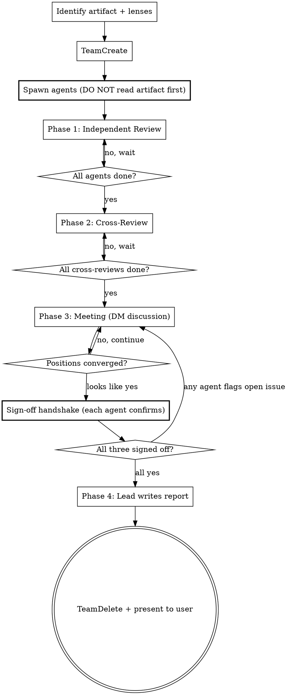

# Design Meeting

Spin up a team of domain-focused agents to review an artifact from multiple angles. Agents review independently, cross-examine each other's work, then meet to debate and converge. The lead facilitates and writes the final report.

**NOT for:** Simple lookups (consulting-agents), single-perspective reviews (consulting-agents), implementation (subagent-driven-development), or generating designs from scratch (brainstorming).

## When to Use

- A spec, design, or architecture document needs validation before implementation
- A complex bug needs multiple domain angles (root cause, blast radius, related patterns)
- An architecture decision needs perspectives on trade-offs
- Any artifact where a single reviewer would miss things
- Jerry asks for "design review," "design meeting," "get fresh eyes on this," or "war room"

## Process Flow



## Phase 0: Setup

1. **Identify the artifact** — file path(s) to the spec, design, code, or bug report
2. **Identify integration points** — If the artifact proposes changes to existing code, identify the files and functions that will be modified. Include these paths in agent prompts so reviewers can verify the design's assumptions against actual code structure. Specs describe what SHOULD happen; code reveals what CAN happen. Reviews that only look at specs miss structural constraints that surface during implementation.
3. **Gather product context** — who is the target user? What is the artifact for? What level of sophistication is needed? This context MUST go in every agent's initial prompt. Discovering product context mid-meeting wastes an entire review cycle.
4. **Pick 2-4 domain lenses** based on what's being reviewed:

| Reviewing | Possible lenses |
|-----------|----------------|
| Binary format spec | Systems/perf, data modeling, consumer/viewer, compatibility |
| API design | Security, ergonomics, backwards compat, error handling |
| Generation algorithm | Domain accuracy, performance, testability |
| Bug investigation | Root cause analysis, reproduction strategy, blast radius, related code patterns |
| Architecture decision | Scalability, maintainability, operational complexity, migration risk |

These are examples — pick lenses that match the artifact.

5. **TeamCreate** with a descriptive name (e.g., `ohex-spec-review`)
6. **Spawn all agents in parallel** — see Agent Prompt Template below

### Critical Sequence Rule

**Spawn agents BEFORE you deeply analyze the artifact.** If you read and analyze first, you WILL rationalize doing everything solo. The sequence is:

```
Identify lenses → TeamCreate → Spawn agents → They read independently
```

Not:

```
Read artifact → "I already see the issues" → Skip team → Solo review
```

## Phase 1: Independent Review

Each agent reads the artifact through their assigned lens and writes findings to:
```
${PROJECT_ROOT}/.claude/scratchpad/meetings/{team-name}/{agent-name}-review.md
```

Report structure:
```markdown
# {Domain Lens} Review: {Artifact Name}

## Summary
2-3 sentence overview of findings from this lens.

## Findings
- **[severity: high/medium/low]** Finding description with evidence

## Questions
Items that need clarification or discussion.

## Recommendations
Specific actionable suggestions.
```

Agents notify lead when done. Wait for all agents before proceeding.

## Phase 2: Cross-Review

Send each agent a message telling them to read the other agents' Phase 1 reports. Provide the file paths explicitly.

Each agent writes cross-review notes to:
```
${PROJECT_ROOT}/.claude/scratchpad/meetings/{team-name}/{agent-name}-cross-review.md
```

Cross-review structure:
```markdown
# Cross-Review: {Agent Name}

## Agreements
Findings from other reviewers I concur with and why.

## Challenges
Findings I disagree with, with my reasoning.

## Gaps
Issues the other reviewers missed that my lens catches.
```

Wait for all agents before proceeding.

## Phase 3: Meeting

1. **Lead poses framing** — 1-2 questions based on themes from Phases 1-2 (e.g., "The main tension is X vs Y — discuss")
2. **Agents respond and discuss** — they DM each other directly to debate, challenge, and refine
3. **Lead monitors** — ask follow-ups if discussion stalls or misses something, but let agents drive
4. **Continue until** positions converge or remaining disagreements are clearly articulated

If agents are only reporting to the lead and not engaging each other, explicitly prompt: "Have you discussed this directly with {agent-name}? Send them a message."

### Reading idle signals correctly

Idle notifications come in two flavors. Read them carefully — they are NOT all "I'm done."

| Idle notification looks like | What it actually means |
|---|---|
| Bare idle, no `summary` | Truly waiting. No DM in flight. Could be done. |
| Idle with `summary: "[to X] ..."` | **Just sent a DM, ball in X's court.** Conversation is alive. NOT done. |
| Idle with summary like "convergence reached" + caveat ("two pushbacks", "one residual note") | Sent a message claiming convergence, but the caveat means an open thread exists. NOT done. |
| Direct message saying "Phase 3 complete, ready for Phase 4" | Done — but only this one agent. Need same from all. |

The dangerous case is the second row. An idle summary like "[to nomenclature] Strong agreement on both" looks like a positive close-out signal, but it actually means the agent shipped a message and is waiting for the recipient to read it and respond. Acting on this as a "done" signal collapses Phase 3 prematurely.

### Sign-off handshake (REQUIRED before Phase 4)

When discussion appears to have converged, **do not jump to Phase 4 or send shutdown_request based on inference.** The agents may still be mid-DM on a question you can't see. One agent claiming "three-way convergence" does not bind the other two — they may have late objections that haven't surfaced yet.

**Required handshake protocol:**

Send each agent an individual DM:

```
Phase 3 close-out check. Before I write the report:

1. Are you fully signed off on the converged positions, or do you have a
   live disagreement / pending message you're waiting on a response for?
2. Is there anything you flagged in cross-review or DMs that the synthesis
   would lose if I write Phase 4 now?

Reply with either "signed off, ready for Phase 4" OR a list of open
threads / dissents I should know about. Do NOT just go idle — explicit
yes/no required.
```

**Wait for explicit text replies from all agents.** Idle notifications are not replies. Bare "going idle" messages without an explicit sign-off do not count.

If any agent flags an open thread or dissent: return to Phase 3 discussion. Surface the issue, let agents debate it, then re-do the handshake. Repeat until all agents explicitly sign off.

If an agent's reply is ambiguous ("mostly aligned, but..."), treat it as NOT signed off and dig in.

**Only after three explicit sign-offs:** proceed to Phase 4 and send shutdown_requests.

### Premature shutdown is unrecoverable

Once you send `shutdown_request` and an agent terminates, you cannot put the question back to them. Any open thread becomes the lead's problem to either:
- adjudicate alone (risky if it's a 2v1 split with substance on both sides — the lead is not always the right adjudicator)
- surface to the user as an open question (honest but signals the meeting didn't fully complete)
- attempt to reconstruct the agent's position from message history (lossy)

The handshake exists specifically to prevent this. **No shortcuts.**

## Phase 4: Report

Lead writes the final report to:
```
${PROJECT_ROOT}/.claude/scratchpad/meetings/{team-name}/report.md
```

Report structure:
```markdown
# Design Meeting Report: {Artifact Name}
Date: {date}
Participants: {agent names and lenses}

## Executive Summary
Key findings and overall assessment.

## Consensus Items
Issues all reviewers agree on.

## Resolved Disagreements
Issues where discussion led to convergence, with reasoning.

## Open Questions
Unresolved items that need human decision.

## Recommendations
Specific changes or actions, with severity. Flag issues — do not modify the artifact.
```

After writing: `TeamDelete` to clean up, then present summary to user with link to full report.

## Agent Prompt Template

```
**Role:** {Domain lens} reviewer for a design meeting.

**Task:** Review the following artifact through your domain lens and write
your findings.

**Product context:** {Who is the target user? What is this for? What
existing systems are NOT the target consumer? This prevents agents from
anchoring on the wrong reference point.}

**Target:** {Brief description of what we're building and at what level
of sophistication.}

**Audience:** {Who needs to understand the output and at what level.}

**Artifact:** Read the file at {path}. Form your own analysis — do not
ask the lead for a summary.

**Integration points (if applicable):** The design proposes modifying
existing code at these locations. Read them and verify the design's
assumptions about how changes can be wired in:
- `{file}:{function}` — design assumes {what}
(Omit this section if the artifact is a greenfield design with no
existing code dependencies.)

**Your domain lens:** {Specific focus areas for this lens.}

**Your teammates:**
- {name-1} — {their lens}
- {name-2} — {their lens}
(etc.)

You can message teammates directly via SendMessage(to: "{name}").
To broadcast to all teammates, message each one individually.
There is no group channel. During the meeting phase, you MUST engage
with teammates directly — send them messages to challenge findings,
ask questions, and debate positions. Do not just report to the lead.

**Phase 1 instructions:** Read the artifact, write your review to:
{scratchpad path}/{your-name}-review.md
Notify the lead when done.
```

## Disciplines

**Spawn before analyzing.** The single most important rule. If the lead reads the artifact first, the team never gets spawned.

**Short, focused messages.** One topic per message to agents. Long multi-topic messages get partially processed.

**Don't skip cross-review.** It's tempting to jump from independent review to meeting. Cross-review is where agents discover they disagree — without it, the meeting produces an echo chamber.

**Let agents drive the meeting.** After framing, resist steering. The value is in agents challenging each other. Intervene only when stuck or off-topic.

**Verify convergence with explicit handshake, not by inference.** "Looks converged" is the trap. Idle summaries like "[to X] Strong agreement" mean a DM is in flight, not that the conversation is done. Send each agent an explicit Phase 3 close-out question and wait for explicit text replies before shutting anyone down. Premature shutdown is unrecoverable — once an agent terminates, you cannot put the question back to them.

## Failure Modes

| Symptom | Cause | Fix |
|---------|-------|-----|
| Lead does solo review | Read artifact before spawning | Follow spawn-before-analyzing rule |
| Superficial cross-reviews | Agents agreeing to be agreeable | Prompt: "What specifically do you disagree with?" |
| Hub-spoke meeting | Agents report to lead, not each other | Prompt: "Discuss this with {name} directly" — send individual messages, not broadcast |
| Meeting goes in circles | No clear framing | Lead poses sharper question, summarizes positions so far |
| Agents miss key issues | Wrong lenses chosen | Add an agent mid-meeting if needed |
| Agents anchor on wrong reference | Missing product context in prompt | Product context MUST be in Phase 0 agent prompts, not discovered mid-meeting |
| Design assumptions don't match code | Agents only reviewed the spec, not integration points | Include integration points in Phase 0; agents must read actual code at modification sites |
| Agents go idle without responding | Timing/message processing | Nudge individually with specific question — individual messages get better engagement than broadcasts |
| Phase 3 declared converged but agent surfaces dissent post-shutdown | Lead inferred convergence from idle summaries / single agent's "three-way convergence" claim instead of running explicit handshake | Always run the Phase 3 sign-off handshake — explicit text replies from all agents required before any shutdown_request. Idle ≠ signed off. |
| Lead ends up adjudicating a 2v1 split alone after agents terminated | Same as above — premature shutdown closed the team floor before disagreement resolved | Handshake catches this. If it slips through anyway: surface the split honestly to the user as an Open Question with both positions, do NOT silently adjudicate. The user is the right tiebreaker for substantive disagreements the team didn't resolve. |
| One agent's "we're converged" message is treated as the whole team's position | Lead assumed spokesperson role exists; it does not | Convergence claims from any single agent are at most that agent's view of where things stand. The handshake binds each agent individually. |
